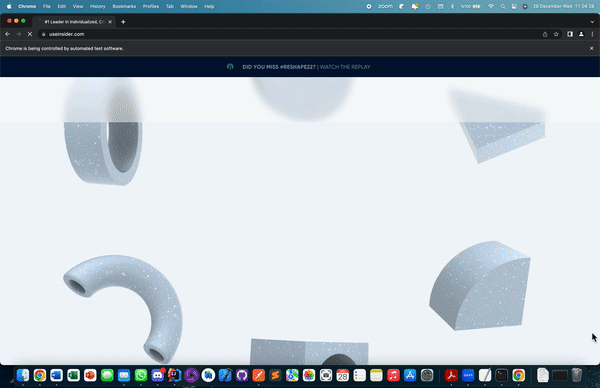
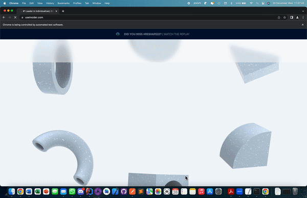

# InsiderTaskProject

This project includes Selenium Task and API Task

API Task is included in the "Test Automation - API" document.

For Selenium Task: 
* Each item in the Task Document (1-5) are included in seperate Tests inside the test file. So, each runs for the desired item respectively.

* The project is consist of 3 main packages under the Test directory which are 
   - insider Test: that includes the only test file "Task_03" named as is in the Task Document
   - pagesPOM    : that includes the only POM file that includes the locators needed
   - utulities   : that includes the methods necessary to run the test

* TestNG is used for Assertions
* Test, BeforeMetod and AfterMetod annotations are included for flexibility
* ConfigurationReader, JavascriptExecutor, Actions, WebDriverWait, Select class and Interfaces are used where needed

* Please find below are tests for Task 4 and Task 5

  

  

